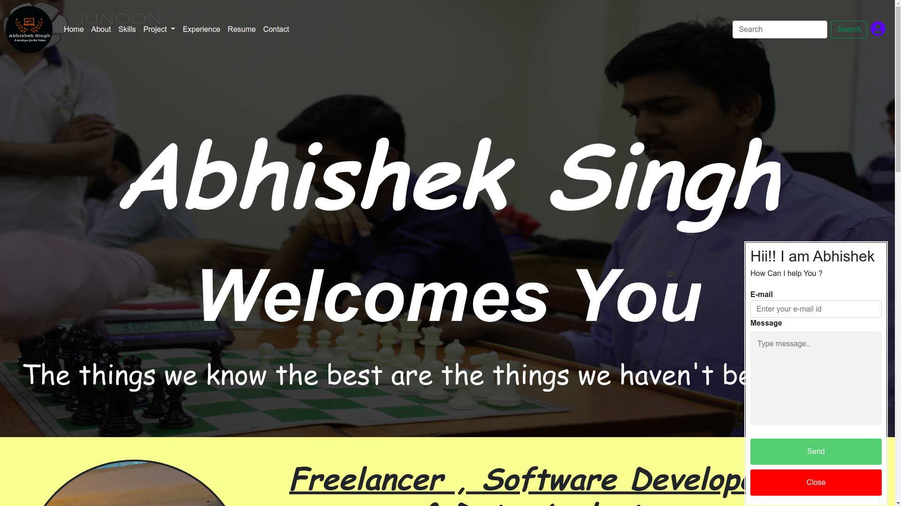
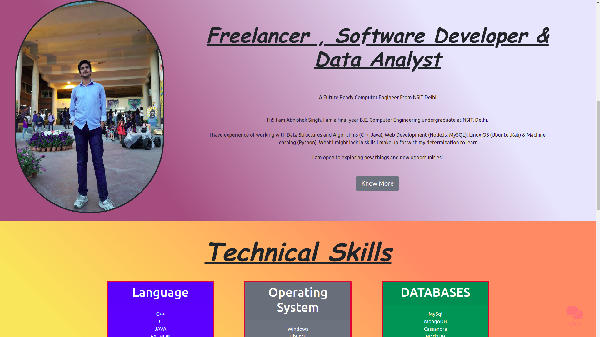
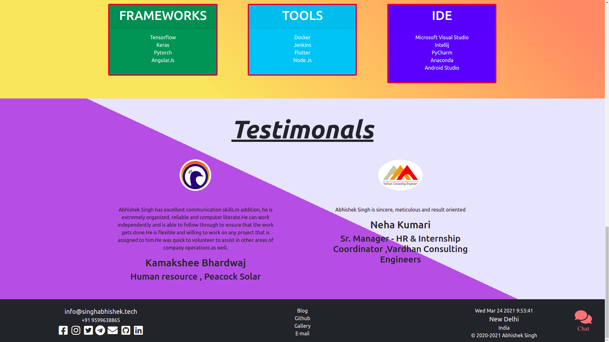
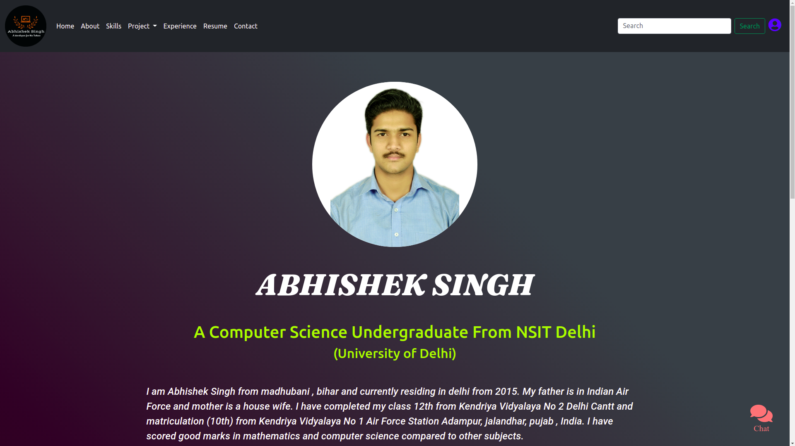
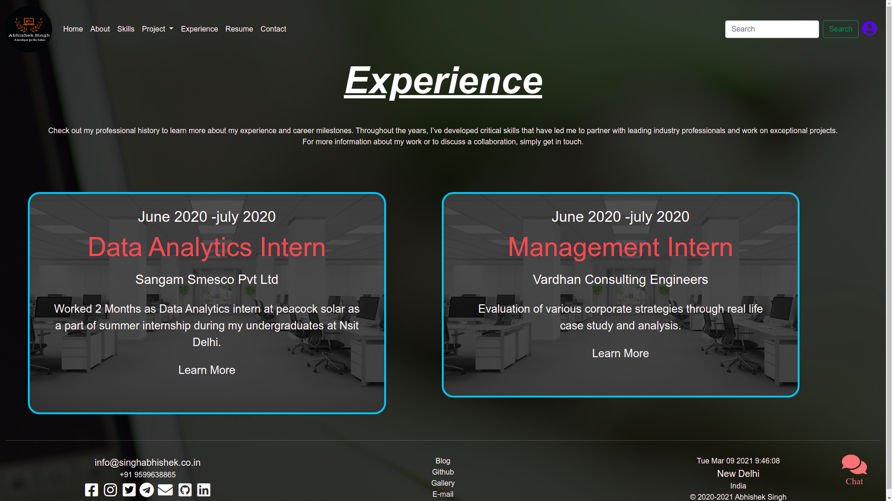
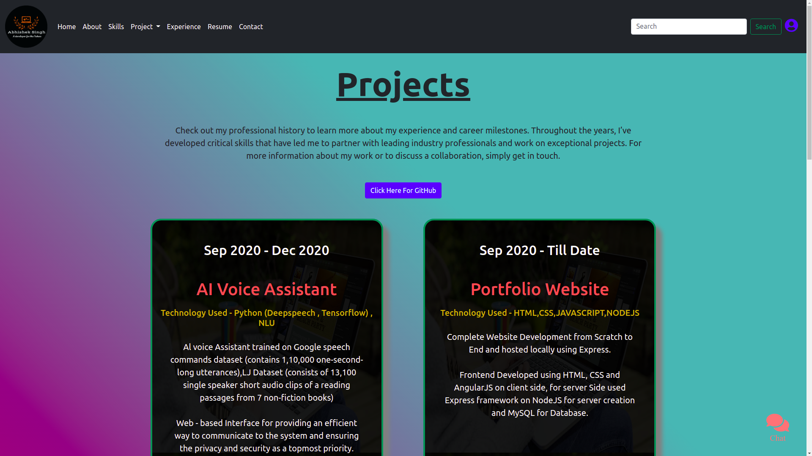

# Portfolio-Website link
www.singhabhishek.tech  
## Build a Portfolio ##
I have build a responsive website that will display images. links and description. This is my first portfolio project.  

  
  
  
  
  
  

## Installation ##
* Nodejs 
* MySQL server 
* MongoDB server 
* Install npm modules by running : npm install
* Create variables.env file for storing private Key and login details

## Running ##
* Download the complete repository 
* run command **npm start** in the terminal/shell  
* Open Browser and access the website at **127.0.0.1**  
