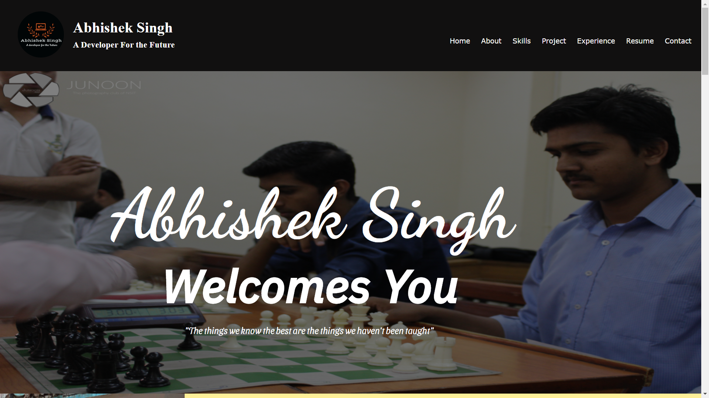
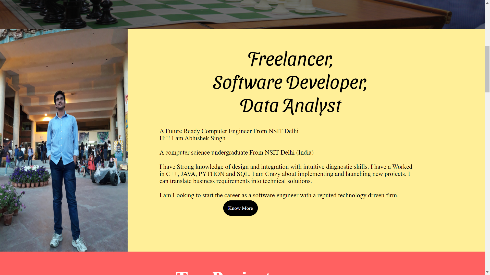
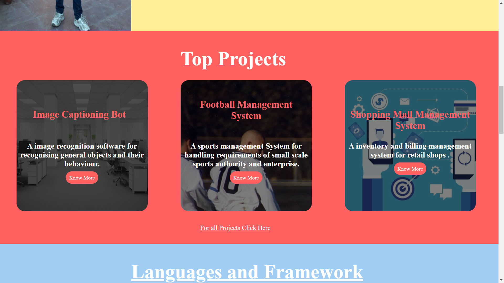
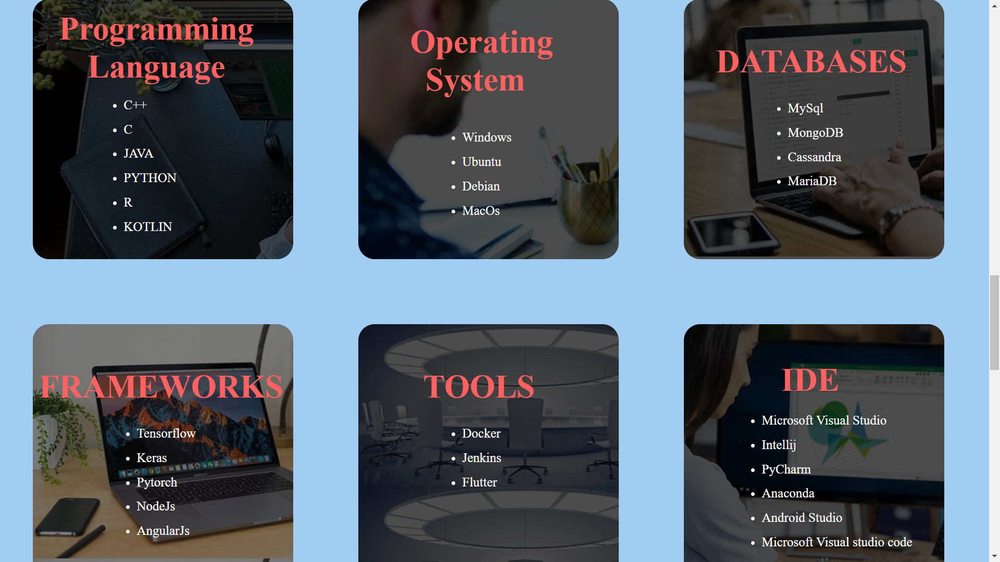
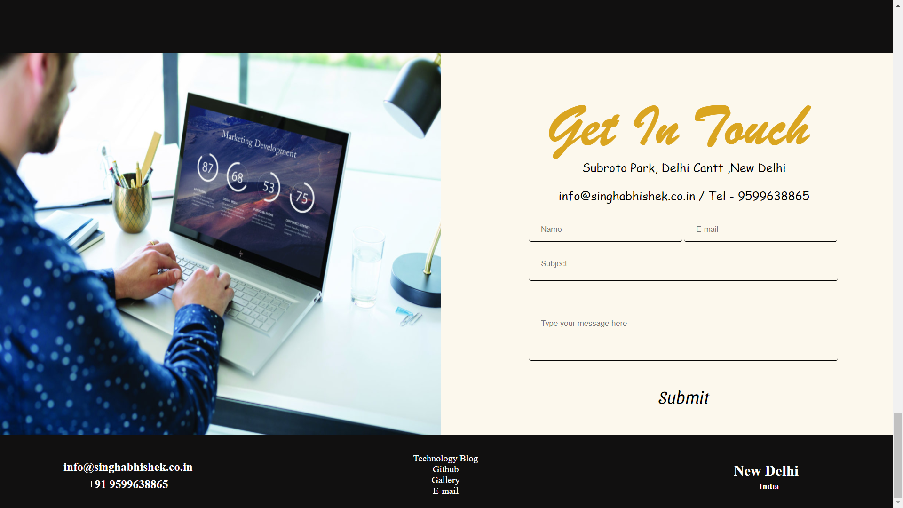

# Portfolio-Website link
www.singhabhishek.co.in  
## Build a Portfolio ##
I have build a responsive website that will display images. links and description. This is my first portfolio project.  
  
  
  
  
  
## Files Included ##
index.html 
CSS Folder 
JAVASCRIPT Folder 
Image folder 
package.json

## Installation ##
* Nodejs 
* MySQL server

## Running ##
* Download the complete repository 
* run command **npm start** in the terminal/shell  
* Open Browser and access the website at **127.0.0.1**  
